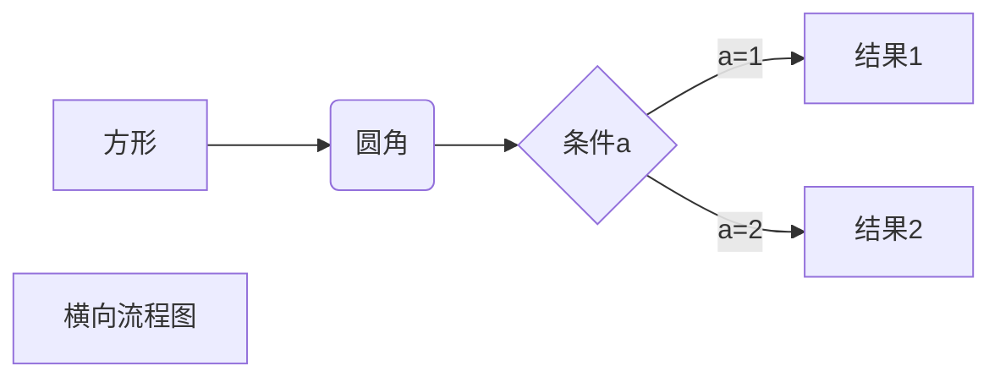
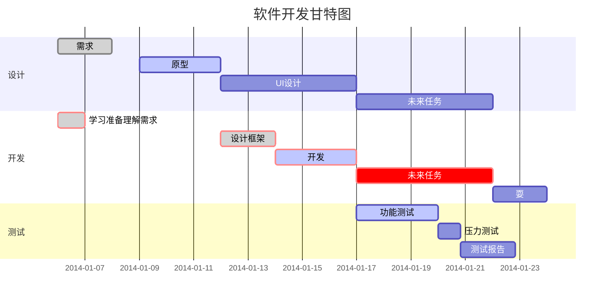

## 课程名称

电力系统仿真

---

## 组员

阮艺源 胡嘉铭 周欣缘 汪笑雨

## 分工

#### 阮艺源
1. 问题1 部分Python程序编写
2. 问题2 基于欧拉法、改进欧拉法、隐式梯形法的微分方程求解的Python程序编写、绘图、中文文档写作
3. 问题3 通用牛顿拉夫逊法、隐式梯形法接口的Python程序编写、绘图、相应部分文档写作

#### 胡嘉铭
1. 问题1 部分Python程序编写、中文文档写作
2. 问题3 输入阻抗、转移阻抗的通用计算、通用数据格式接口程序编写、相应部分中文文档写作

#### 周欣缘
1. 问题1 matlab程序版本
2. 问题2 matlab程序版本
3. 问题3 matlab程序版本
4. 英文版本论文写作

#### 汪笑雨
1. 每个问题论文的修改

:heart:

$e^{i\pi} + 1 =0$

| pp   | pn   |
| ---- | ---- |
| np   | nn   |

H~2~O e^i^

